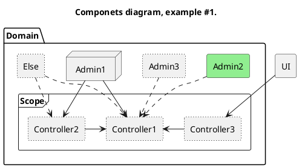
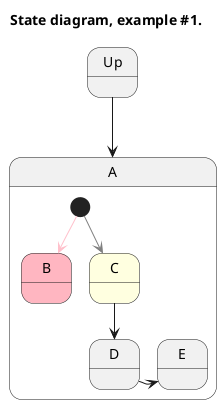

PlantUML
-

[docs](https://plantuml.com/)
[guide](https://crashedmind.github.io/PlantUMLHitchhikersGuide/)

````plantuml
@startuml
allowmixing

!includesub diagram.subpart.1.puml!SUBPART1

hide ComponentID

'comment

#line.dotted
#lightgreen
#lightyellow
#lightpink
````

#### Component diagram.

Components: folder, package, node, rectangle, frame, cloud, database.




