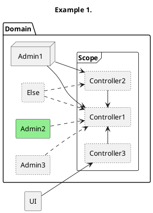

PlantUML
-

[docs](https://plantuml.com/)

````plantuml
@startuml
allowmixing

hide ComponentID
````

#### Component diagram.

Components: folder, package, node, rectangle, frame, cloud, database.


